# System Architecture with Vector Database

This diagram shows the complete end-to-end architecture including all AWS services, data
flows, and logging infrastructure.

```mermaid
%%{init: {'theme':'base', 'themeVariables': { 'primaryColor':'#1976d2','primaryTextColor':'#fff','primaryBorderColor':'#0d47a1','lineColor':'#42a5f5','secondaryColor':'#4caf50','tertiaryColor':'#ff9800'}}}%%

graph TB
    subgraph "User Interface Layer"
        UI[React Frontend<br/>MUI Components<br/>Port 3000]
        style UI fill:#1976d2,stroke:#0d47a1,stroke-width:3px,color:#fff
    end

    subgraph "API Gateway Layer"
        ALB[Application Load Balancer<br/>HTTPS/SSL Termination<br/>Health Checks]
        style ALB fill:#ff9800,stroke:#e65100,stroke-width:3px,color:#fff
    end

    subgraph "ECS Fargate - Reconciliation Service"
        subgraph "Container: reconciliation-api"
            API[FastAPI Application<br/>Port 8080<br/>OpenAPI Docs]
            HANDLER[Lambda Handler Logic<br/>AI Matching Engine<br/>Conflict Detection]

            style API fill:#4caf50,stroke:#2e7d32,stroke-width:2px,color:#fff
            style HANDLER fill:#4caf50,stroke:#2e7d32,stroke-width:2px,color:#fff
        end
    end

    subgraph "Data Ingestion Pipeline"
        SCHEDULER[AWS EventBridge<br/>Scheduled Trigger<br/>Every 1 hour]

        subgraph "ECS Fargate - Ingestion Task"
            INGEST[Data Ingestion Service<br/>Python/FastAPI<br/>Batch Processing]
        end

        style SCHEDULER fill:#9c27b0,stroke:#6a1b9a,stroke-width:2px,color:#fff
        style INGEST fill:#9c27b0,stroke:#6a1b9a,stroke-width:2px,color:#fff
    end

    subgraph "Data Sources"
        EXPERT[(Expert SQL Server<br/>Client/Matter Data<br/>Entity Records<br/>On-Premises)]

        style EXPERT fill:#607d8b,stroke:#37474f,stroke-width:3px,color:#fff
    end

    subgraph "Vector Database Layer"
        VECTOR[(Amazon OpenSearch<br/>Vector Embeddings<br/>k-NN Search<br/>Semantic Similarity)]
        EMBEDDING[Amazon Bedrock<br/>Titan Embeddings<br/>Text Vectorization]

        style VECTOR fill:#00acc1,stroke:#006064,stroke-width:3px,color:#fff
        style EMBEDDING fill:#00acc1,stroke:#006064,stroke-width:2px,color:#fff
    end

    subgraph "AI/ML Services"
        BEDROCK[Amazon Bedrock<br/>Claude 3 Sonnet<br/>Name Matching<br/>Conflict Analysis]

        style BEDROCK fill:#f06292,stroke:#c2185b,stroke-width:3px,color:#fff
    end

    subgraph "Traditional Data Storage"
        DYNAMO[(DynamoDB<br/>ExpertEntities Table<br/>GSI: EntityTypeIndex<br/>Metadata Storage)]

        style DYNAMO fill:#ffc107,stroke:#f57f17,stroke-width:3px,color:#000
    end

    subgraph "Monitoring & Logging"
        CW_LOGS[CloudWatch Logs<br/>/copilot/reconciliation-api<br/>/copilot/ingestion-service<br/>/aws/ecs/]
        CW_METRICS[CloudWatch Metrics<br/>ECS Task Health<br/>API Latency<br/>Bedrock Usage]
        CW_ALARMS[CloudWatch Alarms<br/>Error Rate Alerts<br/>Cost Thresholds<br/>Health Checks]
        XRAY[AWS X-Ray<br/>Distributed Tracing<br/>Performance Analysis]

        style CW_LOGS fill:#ff5722,stroke:#bf360c,stroke-width:2px,color:#fff
        style CW_METRICS fill:#ff5722,stroke:#bf360c,stroke-width:2px,color:#fff
        style CW_ALARMS fill:#ff5722,stroke:#bf360c,stroke-width:2px,color:#fff
        style XRAY fill:#ff5722,stroke:#bf360c,stroke-width:2px,color:#fff
    end

    subgraph "Security & IAM"
        IAM[IAM Roles & Policies<br/>Task Execution Role<br/>Task Role<br/>Bedrock Access<br/>DynamoDB Access<br/>OpenSearch Access]
        SECRETS[AWS Secrets Manager<br/>SQL Server Credentials<br/>API Keys]

        style IAM fill:#795548,stroke:#4e342e,stroke-width:2px,color:#fff
        style SECRETS fill:#795548,stroke:#4e342e,stroke-width:2px,color:#fff
    end

    UI -->|HTTPS Request<br/>POST /api/reconcile| ALB
    ALB -->|Route to Target Group| API
    API --> HANDLER

    HANDLER -->|1. Semantic Search<br/>Query Vector| VECTOR
    VECTOR -->|Top k Similar Entities<br/>Cosine Similarity| HANDLER
    HANDLER -->|2. Get Metadata| DYNAMO
    DYNAMO -->|Entity Details| HANDLER
    HANDLER -->|3. AI Analysis<br/>InvokeModel| BEDROCK
    BEDROCK -->|Match Scores<br/>Reasoning| HANDLER
    HANDLER --> API
    API -->|JSON Response<br/>Match Results| ALB
    ALB --> UI

    SCHEDULER -->|Trigger Every Hour| INGEST
    INGEST -->|SQL Query<br/>SELECT * FROM Clients| EXPERT
    EXPERT -->|Entity Records<br/>Names, Metadata| INGEST
    INGEST -->|Generate Embeddings<br/>Batch Process| EMBEDDING
    EMBEDDING -->|Vector Representations<br/>768-dim| INGEST
    INGEST -->|Store Vectors<br/>Bulk Index| VECTOR
    INGEST -->|Store Metadata<br/>BatchWriteItem| DYNAMO

    API -.->|Application Logs<br/>print statements| CW_LOGS
    HANDLER -.->|Error Logs<br/>Exception Traces| CW_LOGS
    API -.->|Request/Response<br/>Latency Metrics| CW_METRICS
    HANDLER -.->|Bedrock API Calls<br/>Token Usage| CW_METRICS

    INGEST -.->|Ingestion Logs<br/>Progress Updates| CW_LOGS
    INGEST -.->|Batch Metrics<br/>Records Processed| CW_METRICS
    SCHEDULER -.->|Execution History| CW_LOGS

    CW_METRICS -->|Threshold Breached| CW_ALARMS
    CW_ALARMS -.->|SNS Notification<br/>Email/Slack| CW_ALARMS
    API -.->|Trace Segments| XRAY
    HANDLER -.->|Subsegments<br/>Bedrock Calls| XRAY

    IAM -->|Grant Permissions| HANDLER
    IAM -->|Grant Permissions| INGEST
    SECRETS -->|DB Credentials| INGEST
    IAM -->|Bedrock Access| HANDLER
    IAM -->|OpenSearch Access| HANDLER
    IAM -->|DynamoDB Access| HANDLER
```

## Key Components

### User Interface Layer

- **React Frontend**: Modern UI built with Material-UI components
- **Port 3000**: Local development server
- **HTTPS Communication**: Secure API calls to backend

### API Gateway Layer

- **Application Load Balancer**: AWS-managed load balancer
- **SSL/TLS Termination**: HTTPS endpoint for secure communication
- **Health Checks**: Monitors service availability

### Compute Layer

- **ECS Fargate**: Serverless container orchestration
- **FastAPI**: High-performance Python web framework
- **Lambda Handler Logic**: Core reconciliation engine

### Data Ingestion

- **EventBridge Scheduler**: Triggers hourly data sync
- **Batch Processing**: Efficiently processes large entity datasets
- **Delta Updates**: Only syncs modified records

### Vector Database

- **Amazon OpenSearch**: Distributed search and analytics
- **k-NN Search**: Finds semantically similar entities
- **768-dimensional Vectors**: Bedrock Titan embeddings

### AI/ML Services

- **Claude 3 Sonnet**: Advanced language model for name matching
- **Titan Embeddings**: Converts text to vector representations
- **Semantic Understanding**: Context-aware similarity detection

### Data Storage

- **DynamoDB**: NoSQL database for entity metadata
- **Global Secondary Index**: Fast queries by entity type
- **On-Demand Billing**: Pay only for what you use

### Monitoring & Logging

- **CloudWatch Logs**: Centralized log aggregation
- **CloudWatch Metrics**: Performance and health metrics
- **CloudWatch Alarms**: Automated alerting
- **AWS X-Ray**: Distributed request tracing

### Security

- **IAM Roles**: Least-privilege access control
- **Secrets Manager**: Encrypted credential storage
- **VPC Isolation**: Network-level security

---

**Version:** 2.0  
**Last Updated:** January 2024
