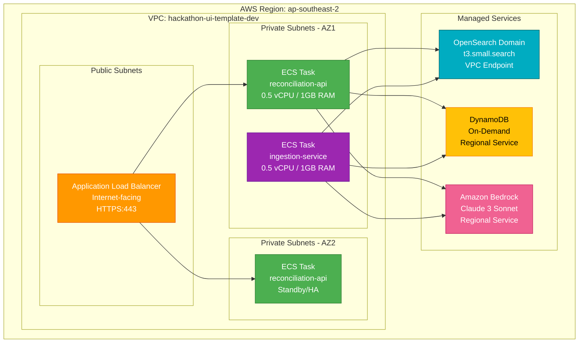

# AWS Deployment Architecture

This diagram shows the physical deployment of services across AWS regions and availability
zones.



## Network Architecture

### VPC Configuration

- **CIDR Block**: `10.0.0.0/16`
- **Availability Zones**: 2 (ap-southeast-2a, ap-southeast-2b)
- **Public Subnets**: `10.0.1.0/24`, `10.0.2.0/24`
- **Private Subnets**: `10.0.101.0/24`, `10.0.102.0/24`

### Security Groups

#### ALB Security Group

```yaml
Ingress:
  - Port: 443
    Protocol: TCP
    Source: 0.0.0.0/0
    Description: HTTPS from internet
  - Port: 80
    Protocol: TCP
    Source: 0.0.0.0/0
    Description: HTTP redirect to HTTPS

Egress:
  - Port: 8080
    Protocol: TCP
    Destination: ECS Task Security Group
    Description: Forward to reconciliation-api
```

#### ECS Task Security Group

```yaml
Ingress:
  - Port: 8080
    Protocol: TCP
    Source: ALB Security Group
    Description: Traffic from load balancer

Egress:
  - Port: 443
    Protocol: TCP
    Destination: 0.0.0.0/0
    Description: HTTPS to AWS services (Bedrock, DynamoDB)
  - Port: 9200
    Protocol: TCP
    Destination: OpenSearch Security Group
    Description: OpenSearch API
```

#### OpenSearch Security Group

```yaml
Ingress:
  - Port: 9200
    Protocol: TCP
    Source: ECS Task Security Group
    Description: API access from ECS tasks
  - Port: 443
    Protocol: TCP
    Source: ECS Task Security Group
    Description: HTTPS access
```

## ECS Fargate Configuration

### Reconciliation API Service

```yaml
ServiceName: reconciliation-api
LaunchType: FARGATE
PlatformVersion: LATEST
DesiredCount: 1
MinHealthyPercent: 100
MaxPercent: 200

TaskDefinition:
  CPU: 512 (0.5 vCPU)
  Memory: 1024 (1 GB)

  Container:
    Name: reconciliation-api
    Image: <account>.dkr.ecr.ap-southeast-2.amazonaws.com/reconciliation-api:latest
    PortMappings:
      - ContainerPort: 8080
        Protocol: tcp

    Environment:
      - Name: AWS_REGION
        Value: ap-southeast-2
      - Name: BEDROCK_MODEL_ID
        Value: anthropic.claude-3-sonnet-20240229-v1:0
      - Name: ENTITIES_TABLE_NAME
        ValueFrom: DynamoDB Table Name (CloudFormation)

    HealthCheck:
      Command: ['CMD-SHELL', 'curl -f http://localhost:8080/health || exit 1']
      Interval: 30
      Timeout: 5
      Retries: 3
      StartPeriod: 60
```

### Ingestion Service Task

```yaml
TaskDefinition:
  CPU: 512
  Memory: 1024

  Container:
    Name: ingestion-service
    Image: <account>.dkr.ecr.ap-southeast-2.amazonaws.com/ingestion-service:latest

    Environment:
      - Name: AWS_REGION
        Value: ap-southeast-2
      - Name: EXPERT_DB_SECRET_ARN
        Value: arn:aws:secretsmanager:ap-southeast-2:xxx:secret:expert-db
      - Name: SYNC_BATCH_SIZE
        Value: '100'
```

## Load Balancer Configuration

### Application Load Balancer

```yaml
Name: hackathon-ui-template-dev-ALB
Scheme: internet-facing
IpAddressType: ipv4
Subnets:
  - Public Subnet AZ1
  - Public Subnet AZ2

Listeners:
  - Port: 443
    Protocol: HTTPS
    SslPolicy: ELBSecurityPolicy-TLS-1-2-2017-01
    Certificates:
      - CertificateArn: arn:aws:acm:...
    DefaultActions:
      - Type: forward
        TargetGroupArn: !Ref ReconciliationAPITargetGroup

  - Port: 80
    Protocol: HTTP
    DefaultActions:
      - Type: redirect
        RedirectConfig:
          Protocol: HTTPS
          Port: 443
          StatusCode: HTTP_301
```

### Target Group

```yaml
Name: reconciliation-api-tg
Protocol: HTTP
Port: 8080
TargetType: ip
VpcId: !Ref VPC

HealthCheck:
  Enabled: true
  Protocol: HTTP
  Path: /health
  Port: 8080
  HealthyThresholdCount: 3
  UnhealthyThresholdCount: 2
  Interval: 30
  Timeout: 10
  Matcher:
    HttpCode: 200

Deregistration:
  DelayTimeout: 30
```

## Auto Scaling Configuration

### Service Auto Scaling

```yaml
ServiceName: reconciliation-api

ScalableTarget:
  MinCapacity: 1
  MaxCapacity: 10
  RoleARN: !GetAtt AutoScalingRole.Arn

ScalingPolicies:
  - PolicyName: CPUScaling
    PolicyType: TargetTrackingScaling
    TargetTrackingScalingPolicyConfiguration:
      PredefinedMetricSpecification:
        PredefinedMetricType: ECSServiceAverageCPUUtilization
      TargetValue: 70.0
      ScaleInCooldown: 300
      ScaleOutCooldown: 60

  - PolicyName: MemoryScaling
    PolicyType: TargetTrackingScaling
    TargetTrackingScalingPolicyConfiguration:
      PredefinedMetricSpecification:
        PredefinedMetricType: ECSServiceAverageMemoryUtilization
      TargetValue: 80.0
      ScaleInCooldown: 300
      ScaleOutCooldown: 60
```

## High Availability Strategy

### Multi-AZ Deployment

- **Load Balancer**: Deployed across 2 AZs
- **ECS Tasks**: Distributed across 2 AZs
- **OpenSearch**: Multi-AZ enabled (3 nodes recommended for prod)
- **DynamoDB**: Global tables for disaster recovery (optional)

### Failure Scenarios

| Scenario                | Impact               | Recovery                         |
| ----------------------- | -------------------- | -------------------------------- |
| Single ECS task failure | No downtime          | ALB routes to healthy task       |
| AZ failure              | Reduced capacity     | Tasks in other AZ handle traffic |
| ALB failure             | Service unavailable  | Route 53 health check + failover |
| OpenSearch node failure | Degraded performance | Automatic replica promotion      |
| Bedrock service outage  | AI matching disabled | Fallback to string matching      |

## Deployment Pipeline

### AWS Copilot Deployment Flow

```
1. Build Docker image locally
2. Push to ECR (Amazon Elastic Container Registry)
3. Update CloudFormation stack
4. Create new ECS task definition
5. Update ECS service (rolling deployment)
6. Wait for health checks to pass
7. Deregister old tasks
```

### Blue/Green Deployment

```yaml
DeploymentConfiguration:
  DeploymentCircuitBreaker:
    Enable: true
    Rollback: true
  MaximumPercent: 200
  MinimumHealthyPercent: 100
```

This ensures:

- New tasks start before old tasks stop
- Automatic rollback on health check failures
- Zero-downtime deployments

## Cost Breakdown

| Resource                         | Configuration           | Monthly Cost |
| -------------------------------- | ----------------------- | ------------ |
| ECS Fargate (reconciliation-api) | 0.5 vCPU, 1GB, 24/7     | $15.00       |
| ECS Fargate (ingestion-service)  | 0.5 vCPU, 1GB, 1hr/day  | $0.50        |
| Application Load Balancer        | 1 ALB, ~500 LCU-hrs     | $20.00       |
| NAT Gateway (2 AZs)              | Data processing charges | $32.00       |
| VPC Endpoints (optional)         | S3, DynamoDB, ECR       | $7.00        |
| **Networking Total**             |                         | **$74.50**   |

### Total Infrastructure Cost

- **Compute + Networking**: $74.50/month
- **Data Services** (OpenSearch, DynamoDB, Bedrock): $60/month
- **Monitoring** (CloudWatch): $9/month
- **Grand Total**: ~$144/month

## Production Recommendations

1. **Enable AWS WAF** on ALB ($5/month + rule charges)
2. **Add VPC Flow Logs** for security auditing
3. **Implement AWS Shield Standard** (free) for DDoS protection
4. **Use AWS Certificate Manager** for SSL/TLS certificates (free)
5. **Enable CloudTrail** for API audit logging
6. **Configure Route 53 health checks** for failover DNS

---

**Version:** 2.0  
**Last Updated:** January 2024
