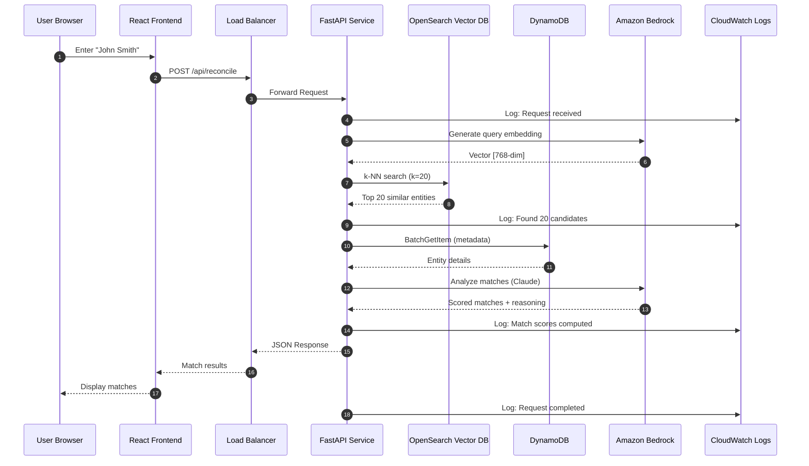

# Name Reconciliation Request Flow

This sequence diagram shows the step-by-step process when a user submits a name
reconciliation request.



## Process Steps

1. **User Input**: User enters entity name (e.g., "John Smith") in the web interface
2. **API Request**: Frontend sends POST request to `/api/reconcile` endpoint
3. **Load Balancer Routing**: ALB routes request to healthy ECS task
4. **Request Logging**: Initial request logged to CloudWatch
5. **Generate Query Embedding**: Convert input text to 768-dimensional vector using
   Bedrock Titan
6. **Vector Embedding Response**: Bedrock returns numerical vector representation
7. **k-NN Search**: Query OpenSearch for 20 most similar entity vectors
8. **Similar Entities**: OpenSearch returns top candidates based on cosine similarity
9. **Candidate Logging**: Log number of potential matches found
10. **Fetch Metadata**: Retrieve full entity details from DynamoDB for candidates
11. **Entity Details**: DynamoDB returns metadata (email, phone, dates, etc.)
12. **AI Analysis**: Send candidates to Claude 3 for intelligent matching
13. **Match Scoring**: Claude returns confidence scores and reasoning for each match
14. **Score Logging**: Log computed match scores
15. **JSON Response**: API returns structured results to load balancer
16. **Return to Frontend**: Load balancer forwards response to React app
17. **Display Results**: UI shows matches with confidence scores and recommendations
18. **Completion Logging**: Log successful request completion

## Request/Response Example

### Request

```json
{
  "entities": [
    {
      "name": "John Smith",
      "entityType": "client"
    }
  ],
  "threshold": 70,
  "includeConflictsCheck": false
}
```

### Response

```json
{
  "results": [
    {
      "inputEntity": {
        "name": "John Smith",
        "entityType": "client"
      },
      "matches": [
        {
          "existingId": "CLI-001",
          "existingName": "John E. Smith",
          "matchScore": 95,
          "matchReason": "exact match with middle initial variation",
          "suggestedAction": "merge",
          "additionalData": {
            "email": "jsmith@example.com",
            "phone": "+1-555-0101"
          }
        }
      ],
      "recommendation": "use_existing",
      "selectedMatch": {
        /* top match */
      }
    }
  ],
  "processingTime": 2450
}
```

## Performance Characteristics

- **Average Latency**: 2-4 seconds
- **Vector Search**: ~50ms (OpenSearch k-NN)
- **DynamoDB Lookup**: ~100ms (BatchGetItem)
- **Bedrock Claude Analysis**: 1.5-3 seconds (depends on number of candidates)
- **Embedding Generation**: ~200ms (Bedrock Titan)

## Error Handling

All errors are logged to CloudWatch and return appropriate HTTP status codes:

- **400 Bad Request**: Missing or invalid input
- **500 Internal Server Error**: Bedrock API errors, DynamoDB failures
- **503 Service Unavailable**: Service overload or health check failures

---

**Version:** 2.0  
**Last Updated:** January 2024
