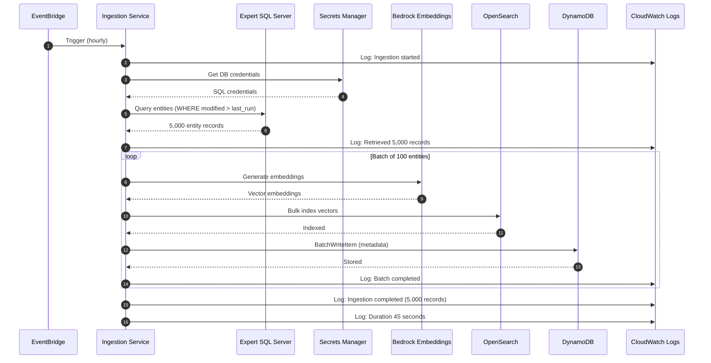

# Data Ingestion Pipeline Flow

This sequence diagram shows how entity data is synced from Expert SQL Server to the vector
database.



## Process Steps

1. **Scheduled Trigger**: EventBridge triggers ingestion service every hour
2. **Start Logging**: Log ingestion job start time and parameters
3. **Retrieve Credentials**: Fetch SQL Server credentials from Secrets Manager
4. **Credentials Response**: Secrets Manager returns encrypted credentials
5. **Delta Query**: Query Expert database for entities modified since last run
6. **Entity Records**: SQL Server returns modified client/matter/contact records
7. **Record Count Logging**: Log total number of records to process
8. **Batch Loop**: Process entities in batches of 100 for efficiency
   - **Generate Embeddings**: Convert entity names to vectors using Bedrock Titan
   - **Vector Response**: Bedrock returns 768-dimensional embeddings
   - **Bulk Index**: Store vectors in OpenSearch for fast k-NN search
   - **Index Confirmation**: OpenSearch confirms successful indexing
   - **Store Metadata**: Save entity details to DynamoDB
   - **Storage Confirmation**: DynamoDB confirms write success
   - **Batch Logging**: Log progress after each batch
9. **Completion Logging**: Log total records processed and duration

## Ingestion Configuration

### Schedule

- **Frequency**: Every 1 hour
- **EventBridge Rule**: `rate(1 hour)`
- **Execution Window**: 15 minutes timeout

### Batch Processing

- **Batch Size**: 100 entities per batch
- **Parallel Processing**: 5 concurrent Bedrock embedding calls
- **Error Handling**: Failed batches are retried 3 times

### Delta Sync Strategy

```sql
SELECT
    ClientId,
    ClientName,
    Email,
    Phone,
    LastModifiedDate
FROM Clients
WHERE LastModifiedDate > @LastSyncTime
```

## Data Transformation

### Input (Expert SQL Server)

```json
{
  "ClientId": "CLI-12345",
  "ClientName": "Acme Corporation LLC",
  "Email": "legal@acme.com",
  "Phone": "+1-555-1234",
  "LastModifiedDate": "2024-01-15T14:30:00Z"
}
```

### Output (OpenSearch Vector)

```json
{
  "id": "CLI-12345",
  "name": "Acme Corporation LLC",
  "vector": [0.234, -0.567, 0.891, ...], // 768 dimensions
  "timestamp": "2024-01-15T15:00:00Z"
}
```

### Output (DynamoDB Metadata)

```json
{
  "id": "CLI-12345",
  "entityType": "client",
  "name": "Acme Corporation LLC",
  "email": "legal@acme.com",
  "phone": "+1-555-1234",
  "lastModified": "2024-01-15T14:30:00Z",
  "lastSynced": "2024-01-15T15:00:00Z"
}
```

## Performance Metrics

- **Average Ingestion Time**: 45 seconds for 5,000 records
- **Throughput**: ~110 entities/second
- **Bedrock Embedding API**: ~20ms per entity
- **OpenSearch Bulk Index**: ~500ms per 100-entity batch
- **DynamoDB BatchWriteItem**: ~200ms per 25-entity batch

## Error Handling

### Retry Logic

- **SQL Connection Failures**: Retry 3 times with exponential backoff
- **Bedrock Throttling**: Automatic retry with jitter
- **OpenSearch Timeouts**: Retry failed batches
- **DynamoDB Conditional Check Failures**: Skip and log

### Monitoring

- CloudWatch Alarms for:
  - Ingestion duration > 5 minutes
  - Error rate > 5%
  - Records processed = 0 (no data sync)

## Optimization Strategies

1. **Connection Pooling**: Reuse SQL Server connections across batches
2. **Async Processing**: Parallel Bedrock embedding generation
3. **Bulk Operations**: Batch writes to OpenSearch and DynamoDB
4. **Incremental Sync**: Only process modified records
5. **Dead Letter Queue**: Failed records sent to SQS for manual review

---

**Version:** 2.0  
**Last Updated:** January 2024
