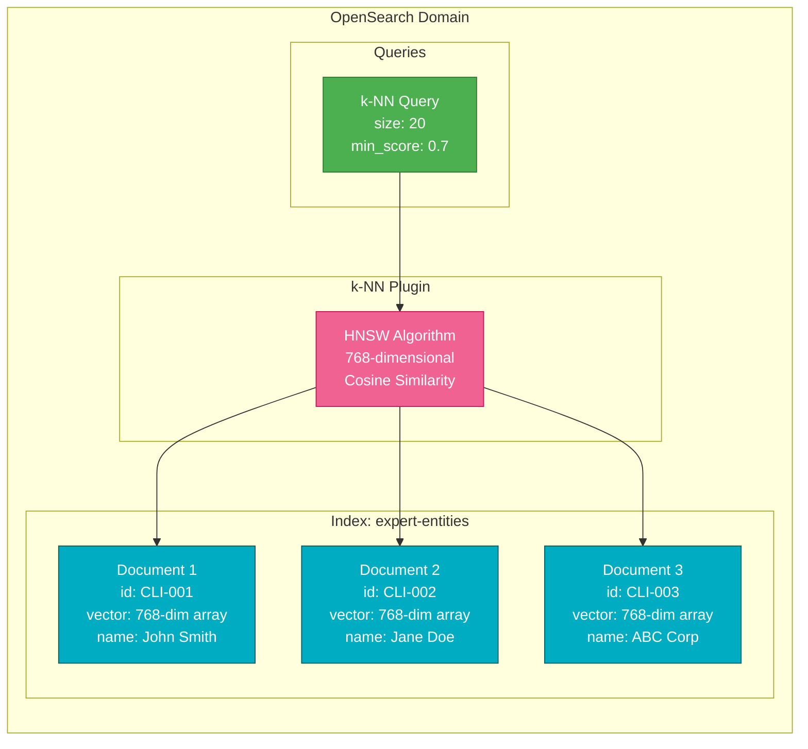

# Vector Database Architecture

This diagram shows the internal structure of Amazon OpenSearch for vector similarity
search.



## OpenSearch Configuration

### Index Mapping

```json
{
  "mappings": {
    "properties": {
      "id": { "type": "keyword" },
      "name": { "type": "text" },
      "vector": {
        "type": "knn_vector",
        "dimension": 768,
        "method": {
          "name": "hnsw",
          "space_type": "cosinesimil",
          "engine": "nmslib",
          "parameters": {
            "ef_construction": 128,
            "m": 24
          }
        }
      },
      "timestamp": { "type": "date" }
    }
  }
}
```

### k-NN Search Query

```json
{
  "size": 20,
  "query": {
    "knn": {
      "vector": {
        "vector": [0.234, -0.567, 0.891, ...],
        "k": 20
      }
    }
  },
  "min_score": 0.7
}
```

## HNSW Algorithm

**Hierarchical Navigable Small World (HNSW)** is a graph-based algorithm for approximate
nearest neighbor search.

### Key Parameters

| Parameter           | Value       | Purpose                                   |
| ------------------- | ----------- | ----------------------------------------- |
| **dimension**       | 768         | Vector size from Bedrock Titan embeddings |
| **space_type**      | cosinesimil | Cosine similarity metric                  |
| **ef_construction** | 128         | Build-time accuracy/speed tradeoff        |
| **m**               | 24          | Maximum number of connections per layer   |

### Performance Characteristics

- **Search Complexity**: O(log n) average case
- **Index Size**: ~4KB per vector (768 dims � 4 bytes + overhead)
- **Query Latency**: 10-100ms for 1M+ vectors
- **Recall**: >95% with proper tuning

## Similarity Scoring

### Cosine Similarity Formula

```
similarity = (A � B) / (||A|| � ||B||)

Where:
- A = query vector
- B = document vector
- � = dot product
- ||�|| = L2 norm
```

### Score Interpretation

| Score Range | Meaning            | Action                 |
| ----------- | ------------------ | ---------------------- |
| 0.95 - 1.00 | Nearly identical   | Auto-merge recommended |
| 0.85 - 0.94 | Very similar       | Review recommended     |
| 0.70 - 0.84 | Moderately similar | Manual review required |
| < 0.70      | Weak match         | Likely not a match     |

## Example Vector Search

### Input Query

```
Name: "John Smith"
```

### Generated Embedding

```json
{
  "vector": [0.234, -0.567, 0.891, 0.123, -0.456, ...]
}
```

### Search Results

```json
{
  "hits": {
    "total": { "value": 3 },
    "max_score": 0.978,
    "hits": [
      {
        "_id": "CLI-001",
        "_score": 0.978,
        "_source": {
          "name": "John E. Smith",
          "id": "CLI-001"
        }
      },
      {
        "_id": "CLI-042",
        "_score": 0.856,
        "_source": {
          "name": "Jon Smith",
          "id": "CLI-042"
        }
      },
      {
        "_id": "CLI-189",
        "_score": 0.734,
        "_source": {
          "name": "Jane Smith",
          "id": "CLI-189"
        }
      }
    ]
  }
}
```

## Scaling Considerations

### Data Volume Estimates

| Entity Type | Count       | Storage Size |
| ----------- | ----------- | ------------ |
| Clients     | 50,000      | ~200 MB      |
| Matters     | 200,000     | ~800 MB      |
| Contacts    | 100,000     | ~400 MB      |
| **Total**   | **350,000** | **~1.4 GB**  |

### Instance Sizing

**Current Configuration**: `t3.small.search`

- **vCPU**: 2
- **Memory**: 2 GB
- **Storage**: 20 GB EBS
- **Max Vectors**: ~500,000 entities

**Production Recommendation**: `r6g.large.search`

- **vCPU**: 2 (ARM-based Graviton2)
- **Memory**: 16 GB
- **Storage**: 100 GB EBS
- **Max Vectors**: ~4,000,000 entities
- **Cost**: ~$150/month

## Maintenance Tasks

### Index Refresh

```bash
# Force merge segments (optimize search performance)
POST /expert-entities/_forcemerge?max_num_segments=1
```

### Reindex with New Mapping

```bash
# Create new index with updated settings
POST /_reindex
{
  "source": { "index": "expert-entities" },
  "dest": { "index": "expert-entities-v2" }
}
```

### Monitor Index Health

```bash
# Check index stats
GET /expert-entities/_stats

# Check cluster health
GET /_cluster/health
```

## Best Practices

1. **Batch Indexing**: Use bulk API for >100 documents
2. **Shard Sizing**: 20-50GB per shard for optimal performance
3. **Replica Count**: 1 replica for high availability
4. **Refresh Interval**: 30s for reduced indexing overhead
5. **Circuit Breakers**: Prevent memory overflow (80% heap limit)

---

**Version:** 2.0  
**Last Updated:** January 2024
