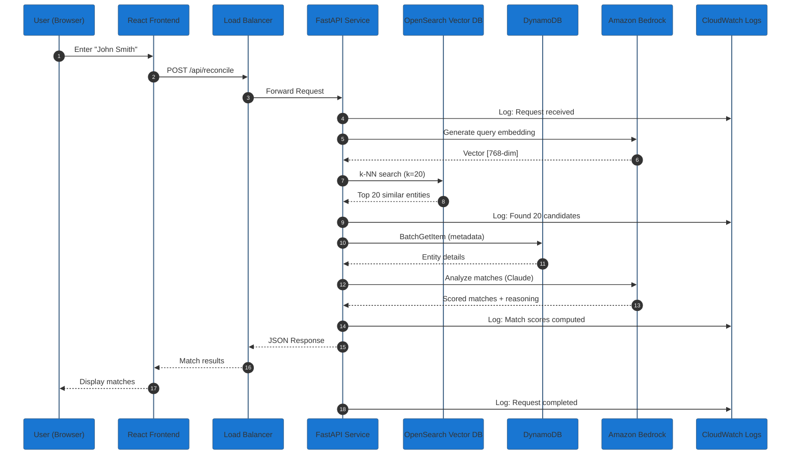
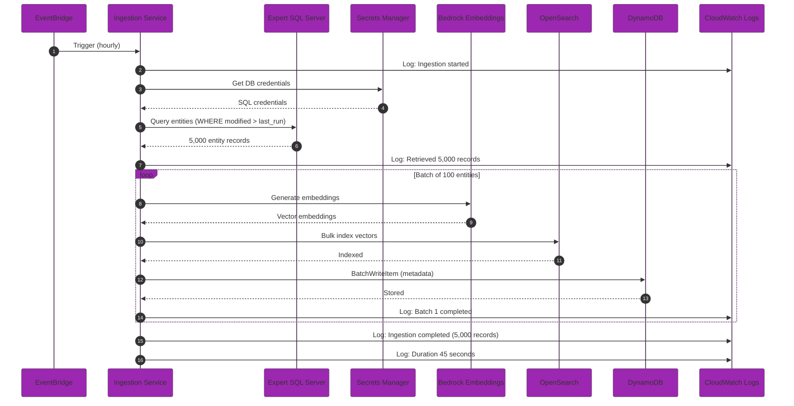
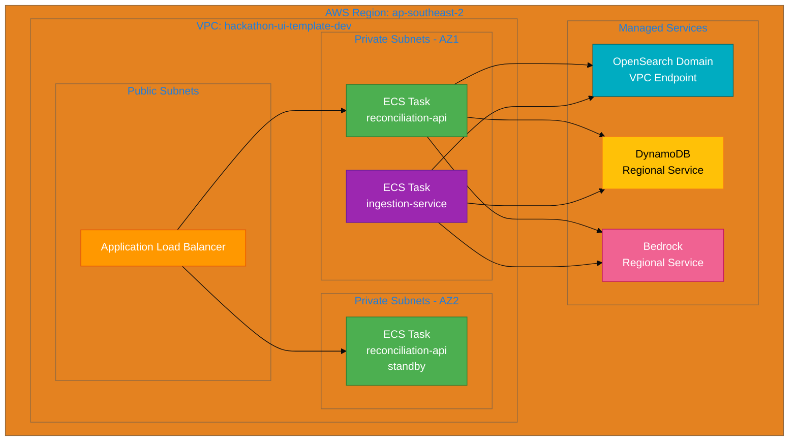

# AI-Powered Name Reconciliation Architecture

## System Architecture with Vector Database

```mermaid
%%{init: {'theme':'base', 'themeVariables': { 'primaryColor':'#1976d2','primaryTextColor':'#fff','primaryBorderColor':'#0d47a1','lineColor':'#42a5f5','secondaryColor':'#4caf50','tertiaryColor':'#ff9800','noteBkgColor':'#fff3e0','noteTextColor':'#000','noteBorderColor':'#ff9800'}}}%%

graph TB
    subgraph "User Interface Layer"
        UI[React Frontend<br/>MUI Components<br/>Port 3000]
        style UI fill:#1976d2,stroke:#0d47a1,stroke-width:3px,color:#fff
    end

    subgraph "API Gateway Layer"
        ALB[Application Load Balancer<br/>HTTPS/SSL Termination<br/>Health Checks]
        style ALB fill:#ff9800,stroke:#e65100,stroke-width:3px,color:#fff
    end

    subgraph "ECS Fargate - Reconciliation Service"
        subgraph "Container: reconciliation-api"
            API[FastAPI Application<br/>Port 8080<br/>OpenAPI Docs]
            HANDLER[Lambda Handler Logic<br/>AI Matching Engine<br/>Conflict Detection]

            style API fill:#4caf50,stroke:#2e7d32,stroke-width:2px,color:#fff
            style HANDLER fill:#4caf50,stroke:#2e7d32,stroke-width:2px,color:#fff
        end
    end

    subgraph "Data Ingestion Pipeline"
        SCHEDULER[AWS EventBridge<br/>Scheduled Trigger<br/>Every 1 hour]

        subgraph "ECS Fargate - Ingestion Task"
            INGEST[Data Ingestion Service<br/>Python/FastAPI<br/>Batch Processing]
        end

        style SCHEDULER fill:#9c27b0,stroke:#6a1b9a,stroke-width:2px,color:#fff
        style INGEST fill:#9c27b0,stroke:#6a1b9a,stroke-width:2px,color:#fff
    end

    subgraph "Data Sources"
        EXPERT[(Expert SQL Server<br/>Client/Matter Data<br/>Entity Records<br/>On-Premises)]

        style EXPERT fill:#607d8b,stroke:#37474f,stroke-width:3px,color:#fff
    end

    subgraph "Vector Database Layer"
        VECTOR[(Amazon OpenSearch<br/>Vector Embeddings<br/>k-NN Search<br/>Semantic Similarity)]
        EMBEDDING[Amazon Bedrock<br/>Titan Embeddings<br/>Text Vectorization]

        style VECTOR fill:#00acc1,stroke:#006064,stroke-width:3px,color:#fff
        style EMBEDDING fill:#00acc1,stroke:#006064,stroke-width:2px,color:#fff
    end

    subgraph "AI/ML Services"
        BEDROCK[Amazon Bedrock<br/>Claude 3 Sonnet<br/>Name Matching<br/>Conflict Analysis]

        style BEDROCK fill:#f06292,stroke:#c2185b,stroke-width:3px,color:#fff
    end

    subgraph "Traditional Data Storage"
        DYNAMO[(DynamoDB<br/>ExpertEntities Table<br/>GSI: EntityTypeIndex<br/>Metadata Storage)]

        style DYNAMO fill:#ffc107,stroke:#f57f17,stroke-width:3px,color:#000
    end

    subgraph "Monitoring & Logging"
        CW_LOGS[CloudWatch Logs<br/>/copilot/reconciliation-api<br/>/copilot/ingestion-service<br/>/aws/ecs/]
        CW_METRICS[CloudWatch Metrics<br/>ECS Task Health<br/>API Latency<br/>Bedrock Usage]
        CW_ALARMS[CloudWatch Alarms<br/>Error Rate Alerts<br/>Cost Thresholds<br/>Health Checks]
        XRAY[AWS X-Ray<br/>Distributed Tracing<br/>Performance Analysis]

        style CW_LOGS fill:#ff5722,stroke:#bf360c,stroke-width:2px,color:#fff
        style CW_METRICS fill:#ff5722,stroke:#bf360c,stroke-width:2px,color:#fff
        style CW_ALARMS fill:#ff5722,stroke:#bf360c,stroke-width:2px,color:#fff
        style XRAY fill:#ff5722,stroke:#bf360c,stroke-width:2px,color:#fff
    end

    subgraph "Security & IAM"
        IAM[IAM Roles & Policies<br/>Task Execution Role<br/>Task Role<br/>Bedrock Access<br/>DynamoDB Access<br/>OpenSearch Access]
        SECRETS[AWS Secrets Manager<br/>SQL Server Credentials<br/>API Keys]

        style IAM fill:#795548,stroke:#4e342e,stroke-width:2px,color:#fff
        style SECRETS fill:#795548,stroke:#4e342e,stroke-width:2px,color:#fff
    end

    %% User Flow
    UI -->|HTTPS Request<br/>POST /api/reconcile| ALB
    ALB -->|Route to Target Group| API
    API --> HANDLER

    %% AI Matching Flow
    HANDLER -->|1. Semantic Search<br/>Query Vector| VECTOR
    VECTOR -->|Top k Similar Entities<br/>Cosine Similarity| HANDLER
    HANDLER -->|2. Get Metadata| DYNAMO
    DYNAMO -->|Entity Details| HANDLER
    HANDLER -->|3. AI Analysis<br/>InvokeModel| BEDROCK
    BEDROCK -->|Match Scores<br/>Reasoning| HANDLER
    HANDLER --> API
    API -->|JSON Response<br/>Match Results| ALB
    ALB --> UI

    %% Data Ingestion Flow
    SCHEDULER -->|Trigger Every Hour| INGEST
    INGEST -->|SQL Query<br/>SELECT * FROM Clients| EXPERT
    EXPERT -->|Entity Records<br/>Names, Metadata| INGEST
    INGEST -->|Generate Embeddings<br/>Batch Process| EMBEDDING
    EMBEDDING -->|Vector Representations<br/>768-dim| INGEST
    INGEST -->|Store Vectors<br/>Bulk Index| VECTOR
    INGEST -->|Store Metadata<br/>BatchWriteItem| DYNAMO

    %% Logging Flow - Reconciliation Service
    API -.->|Application Logs<br/>print() statements| CW_LOGS
    HANDLER -.->|Error Logs<br/>Exception Traces| CW_LOGS
    API -.->|Request/Response<br/>Latency Metrics| CW_METRICS
    HANDLER -.->|Bedrock API Calls<br/>Token Usage| CW_METRICS

    %% Logging Flow - Ingestion Service
    INGEST -.->|Ingestion Logs<br/>Progress Updates| CW_LOGS
    INGEST -.->|Batch Metrics<br/>Records Processed| CW_METRICS
    SCHEDULER -.->|Execution History| CW_LOGS

    %% Monitoring Flow
    CW_METRICS -->|Threshold Breached| CW_ALARMS
    CW_ALARMS -.->|SNS Notification<br/>Email/Slack| CW_ALARMS
    API -.->|Trace Segments| XRAY
    HANDLER -.->|Subsegments<br/>Bedrock Calls| XRAY

    %% Security Flow
    IAM -->|Grant Permissions| HANDLER
    IAM -->|Grant Permissions| INGEST
    SECRETS -->|DB Credentials| INGEST
    IAM -->|Bedrock Access| HANDLER
    IAM -->|OpenSearch Access| HANDLER
    IAM -->|DynamoDB Access| HANDLER

    %% Styling for connection types
    linkStyle 0,1,2 stroke:#1976d2,stroke-width:3px
    linkStyle 3,4,5,6,7,8,9 stroke:#4caf50,stroke-width:2px
    linkStyle 10,11,12,13,14,15 stroke:#9c27b0,stroke-width:2px
    linkStyle 16,17,18,19,20,21,22,23 stroke:#ff5722,stroke-width:1px,stroke-dasharray: 5
    linkStyle 24,25,26 stroke:#ff5722,stroke-width:2px
    linkStyle 27,28,29,30,31,32 stroke:#795548,stroke-width:1px,stroke-dasharray: 3
```

## Data Flow Sequences

### 1. Name Reconciliation Request Flow



### 2. Data Ingestion Pipeline Flow



## Component Details

### Vector Database Architecture (Amazon OpenSearch)

```mermaid
%%{init: {'theme':'base', 'themeVariables': { 'primaryColor':'#00acc1'}}}%%

graph LR
    subgraph "OpenSearch Domain"
        subgraph "Index: expert-entities"
            DOC1[Document 1<br/>id: CLI-001<br/>vector: [0.234, -0.567, ...]<br/>name: 'John Smith']
            DOC2[Document 2<br/>id: CLI-002<br/>vector: [0.123, -0.456, ...]<br/>name: 'Jane Doe']
            DOC3[Document N<br/>...]
        end

        subgraph "k-NN Plugin"
            KNN[HNSW Algorithm<br/>768-dimensional<br/>Cosine Similarity]
        end

        subgraph "Queries"
            QUERY[k-NN Query<br/>size: 20<br/>min_score: 0.7]
        end
    end

    QUERY --> KNN
    KNN --> DOC1
    KNN --> DOC2
    KNN --> DOC3

    style DOC1 fill:#00acc1,stroke:#006064,color:#fff
    style DOC2 fill:#00acc1,stroke:#006064,color:#fff
    style DOC3 fill:#00acc1,stroke:#006064,color:#fff
    style KNN fill:#f06292,stroke:#c2185b,color:#fff
    style QUERY fill:#4caf50,stroke:#2e7d32,color:#fff
```

### Logging Architecture

```mermaid
%%{init: {'theme':'base', 'themeVariables': { 'primaryColor':'#ff5722'}}}%%

graph TB
    subgraph "Log Sources"
        APP[Application Logs<br/>Python print()]
        ECS[ECS Task Logs<br/>Container stdout/stderr]
        ALB_LOG[ALB Access Logs<br/>S3 Bucket]
    end

    subgraph "CloudWatch Logs"
        LG1[/copilot/reconciliation-api<br/>Retention: 30 days]
        LG2[/copilot/ingestion-service<br/>Retention: 30 days]
        LG3[/aws/ecs/cluster<br/>Retention: 7 days]
    end

    subgraph "Log Processing"
        INSIGHTS[CloudWatch Insights<br/>SQL-like Queries<br/>Pattern Analysis]
        METRIC[Metric Filters<br/>Error Count<br/>Latency p95]
    end

    subgraph "Alerting"
        ALARM[CloudWatch Alarms<br/>Error Rate > 5%<br/>Latency > 2s]
        SNS[SNS Topic<br/>Email/Slack Notifications]
    end

    APP --> LG1
    ECS --> LG1
    ECS --> LG2
    ECS --> LG3
    ALB_LOG --> LG1

    LG1 --> INSIGHTS
    LG2 --> INSIGHTS
    LG1 --> METRIC
    LG2 --> METRIC

    METRIC --> ALARM
    ALARM --> SNS

    style APP fill:#ff5722,stroke:#bf360c,color:#fff
    style ECS fill:#ff5722,stroke:#bf360c,color:#fff
    style ALB_LOG fill:#ff5722,stroke:#bf360c,color:#fff
    style LG1 fill:#ff9800,stroke:#e65100,color:#fff
    style LG2 fill:#ff9800,stroke:#e65100,color:#fff
    style LG3 fill:#ff9800,stroke:#e65100,color:#fff
    style INSIGHTS fill:#ffc107,stroke:#f57f17,color:#000
    style METRIC fill:#ffc107,stroke:#f57f17,color:#000
    style ALARM fill:#f44336,stroke:#b71c1c,color:#fff
    style SNS fill:#f44336,stroke:#b71c1c,color:#fff
```

## Technology Stack Summary

| Layer              | Technology                    | Purpose                    |
| ------------------ | ----------------------------- | -------------------------- |
| **Frontend**       | React 19 + MUI + TypeScript   | User interface             |
| **API Gateway**    | AWS Application Load Balancer | HTTPS termination, routing |
| **Compute**        | AWS ECS Fargate               | Serverless containers      |
| **API Framework**  | FastAPI + Uvicorn             | REST API endpoints         |
| **Vector Search**  | Amazon OpenSearch (k-NN)      | Semantic similarity search |
| **Embeddings**     | Amazon Bedrock (Titan)        | Text ? Vector conversion   |
| **AI Matching**    | Amazon Bedrock (Claude 3)     | Intelligent name matching  |
| **Metadata Store** | Amazon DynamoDB               | Entity metadata            |
| **Source DB**      | Expert SQL Server             | Legacy system (read-only)  |
| **Orchestration**  | AWS EventBridge               | Scheduled ingestion        |
| **Logging**        | CloudWatch Logs               | Centralized logging        |
| **Monitoring**     | CloudWatch Metrics + Alarms   | System health              |
| **Tracing**        | AWS X-Ray                     | Distributed tracing        |
| **IaC**            | AWS Copilot CLI               | Infrastructure automation  |
| **Secrets**        | AWS Secrets Manager           | Credential management      |
| **Security**       | IAM Roles + Policies          | Access control             |

## Log Event Examples

### CloudWatch Log Groups

```
/copilot/reconciliation-api
??? 2024/01/15/task-id-1234
?   ??? 14:23:01 INFO: Request received: POST /api/reconcile
?   ??? 14:23:01 DEBUG: Generating embedding for 'John Smith'
?   ??? 14:23:02 DEBUG: OpenSearch query returned 18 candidates
?   ??? 14:23:02 DEBUG: DynamoDB BatchGetItem: 18 items
?   ??? 14:23:03 INFO: Bedrock InvokeModel: claude-3-sonnet
?   ??? 14:23:05 INFO: Match scores: [95, 87, 72, ...]
?   ??? 14:23:05 INFO: Response sent: 200 OK (4.2s)

/copilot/ingestion-service
??? 2024/01/15/task-id-5678
?   ??? 15:00:00 INFO: Ingestion started (scheduled)
?   ??? 15:00:01 INFO: Retrieved 5,234 entities from Expert
?   ??? 15:00:05 INFO: Batch 1/53 completed (100 entities)
?   ??? 15:00:10 INFO: Batch 2/53 completed (100 entities)
?   ??? ...
?   ??? 15:02:45 INFO: Ingestion completed: 5,234 entities (2m 45s)

/aws/ecs/hackathon-ui-template-dev
??? Container health checks
??? Task state changes
??? Service events
```

## Cost Breakdown (Monthly Estimates)

| Service                              | Configuration                       | Cost            |
| ------------------------------------ | ----------------------------------- | --------------- |
| **ECS Fargate** (reconciliation-api) | 0.5 vCPU, 1GB RAM, 24/7             | $15             |
| **ECS Fargate** (ingestion-service)  | 0.5 vCPU, 1GB RAM, 1hr/day          | $0.50           |
| **Application Load Balancer**        | 1 ALB + LCU charges                 | $20             |
| **Amazon OpenSearch**                | 1x t3.small.search instance         | $35             |
| **Bedrock Claude 3 Sonnet**          | 500 requests/day, 2K tokens avg     | $15             |
| **Bedrock Titan Embeddings**         | 5K entities/hour, hourly ingestion  | $5              |
| **DynamoDB**                         | On-demand, 10K reads, 1K writes/day | $2              |
| **CloudWatch Logs**                  | 10 GB/month, 30-day retention       | $5              |
| **CloudWatch Metrics + Alarms**      | Custom metrics, 10 alarms           | $3              |
| **Secrets Manager**                  | 1 secret (SQL credentials)          | $0.40           |
| **ECR + Data Transfer**              | Docker images, API traffic          | $3              |
| **Total**                            |                                     | **~$104/month** |

## Deployment Architecture



---

**Architecture Version:** 2.0  
**Last Updated:** January 2024  
**Maintained By:** Aderant Hackathon Team
